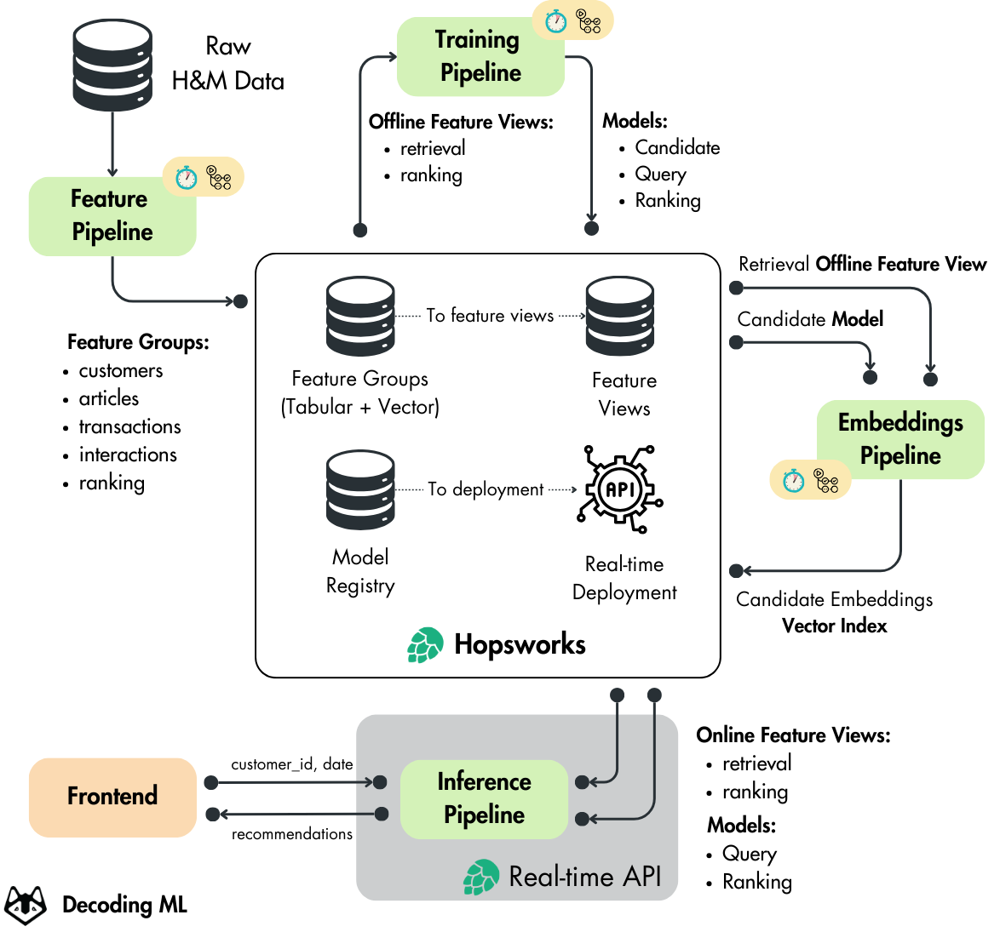

  <h1>Hands-on H&M Real-Time Personalized Recommender</h1>
  
Open source course by <a href="https://decodingml.substack.com">Decoding ML</a> in collaboration with <a href="https://rebrand.ly/homepage-github">Hopsworks</a>

 

  

## What will you learn?

The **Hands-on H&M Real-Time Personalized Recommender”** is a free course that will teach you how to build and deploy a real-time personalized recommender for H&M fashion articles using the 4-stage recommender architecture, the two-tower model design and the Hopsworks AI Lakehouse. 

You will learn:

- building a recommender using the 4-stage recommender architecture
- training a two-tower model for generating users and item embeddings
- designing a scalable ML system using the FTI architecture
- using MLOps best practices such as a feature store and model registry
- deploying the real-time personalized recommender
- enhancing recommendations with LLMs
- implementing an interactive web interface

## Who is this for?

## Costs?

## How will you learn?

## Questions and troubleshooting

## Lessons

| Lesson | Title | Description | Local Notebooks | Colab Notebooks |
|--------|-------|-------------|----------------|-----------------|
| 1 | [Building a TikTok-like recommender](https://decodingml.substack.com/p/33d3273e-b8e3-4d98-b160-c3d239343022) | Learn how to architect a recommender system using the 4-stage architecture and two-tower model. | - | - |
| 2 | The feature pipeline | Learn how to build a scalable feature pipeline (WIP) | [1_fp_computing_features.ipynb](notebooks/1_fp_computing_features.ipynb) | - |
| 3 | The training pipeline | Learn how to train and evaluate recommendation models (WIP) | [2_tp_training_retrieval_model.ipynb](notebooks/2_tp_training_retrieval_model.ipynb), [3_tp_training_ranking_model.ipynb](notebooks/3_tp_training_ranking_model.ipynb) | - |
| 4 | The inference pipeline | Learn how to deploy models for real-time inference (WIP) | [4_fp_computing_item_embeddings.ipynb](notebooks/4_fp_computing_item_embeddings.ipynb),  [5_ip_creating_deployments.ipynb](notebooks/5_ip_creating_deployments.ipynb) | - |
| 5 | Building personalized real-time recommenders with LLMs | Learn how to enhance recommendations with LLMs (WIP) | - | - |

## Folder structure

## Install and usage

To understand how to install and run the code, go to the [INSTALL_AND_USAGE]() dedicated document.

> [!Note]
> Even though you can run everything solely using the INSTALL_AND_USAGE dedicated document, we recommend that you read the articles to understand how the personalized recommender works fully.

## License

This course is an open-source project released under the Apache-2.0 license. Thus, as long you distribute our LICENSE and acknowledge your project is based on our work, you can safely clone or fork this project and use it as a source of inspiration for your educational projects (e.g., university, college degree, personal projects, etc.).

## Sponsors

